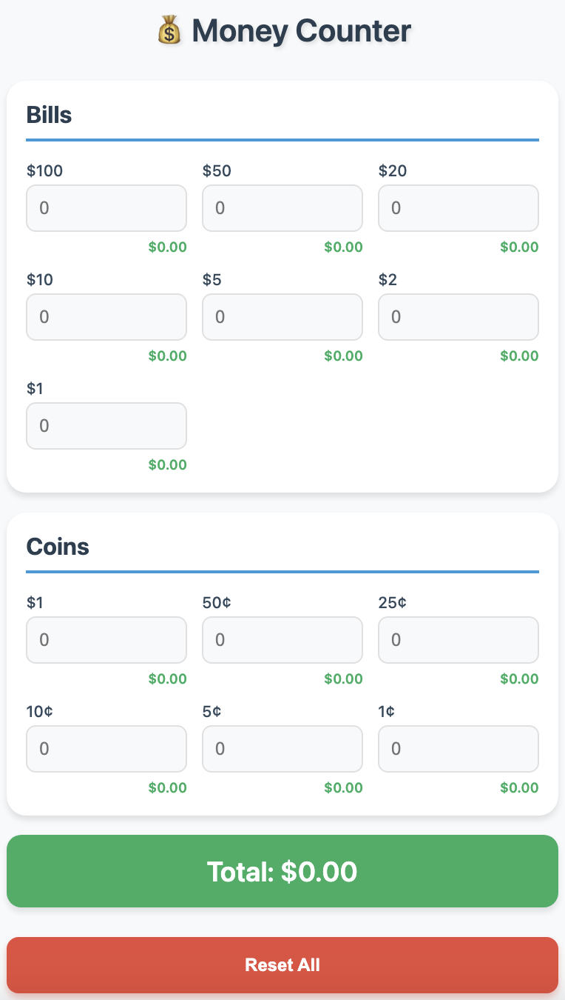

# 💰 Money Counter App

A clean, ad-free money counter Progressive Web App (PWA) built with React for quick and easy register counting.

## ✨ Features

- **Real-time calculations** - Total updates instantly as you type
- **Automatic saving** - Never lose your count, even if you close the app
- **Mobile-friendly** - Large buttons, numeric keypad on iPhones
- **Separated sections** - Bills and coins organized neatly
- **Safe reset** - Confirmation dialog prevents accidental data loss
- **Subtotals** - See running totals for each denomination
- **Installable** - Add to iPhone home screen as a real app

## 📱 How to Use

1. Enter quantities for each bill and coin denomination
2. Watch the total update automatically at the bottom
3. Each field shows its subtotal in green
4. Use Reset All to start over (with confirmation)

## 🛠️ Technologies Used

- React (with Hooks: useState, useEffect)
- Vite (for fast development and building)
- LocalStorage API (for data persistence)
- CSS (with mobile-first responsive design)
- Progressive Web App capabilities

## 🚀 Installation

To run this project locally:

**Clone this repository**
git clone https://github.com/YOUR-USERNAME/money-counter.git

**Navigate to project folder**
cd money-counter

**Install dependencies**
npm install

**Start development server**
npm run dev

## 📲 Install on iPhone
Open the app in Safari on your iPhone

Tap the Share button (square with arrow)

Scroll down and tap "Add to Home Screen"

Name it and tap "Add"

Open from home screen like a native app!

## 💡 Why I Built This
I created this app to solve a frustration at work where the existing money counting website was slow, buggy, and full of ads. This clean, fast alternative makes counting my register quick and pleasant. It's now my daily driver for closing out registers!

## 🔮 Future Improvements
Dark mode support

## 📄 License
MIT
